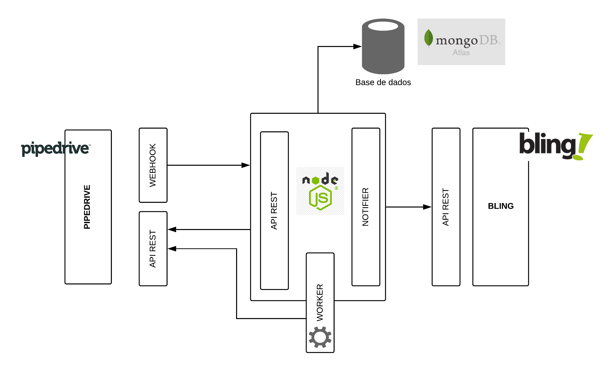

# LINK PIPEDRIVE BLING.

Api para fins de avaliação tecnica, que tem como principal objetivo integrar as plataformas Pipedrive e Bling. A integração deve buscar as oportunidades com status igual a ganho no Pipedrive, depois inseri-las como pedido no Bling

# Arquitetura



Para realizar a integracao com o Pipedrive foi utilizado o webhook que emite eventos relacionados aos `deals` realizados dentro do Pipedrive. Entao, qualquer atualizacao é capturada em tempo real pela API de integracao. Além disso, foi criado um worker para ser ativado de tempos em tempos para coletar possiveis deals que nao foram enviados via websocket, como por exemplo, a primeira carga do sistema, ou, o servidor ficou um tempo off... Dessa forma, há a necessidade do worker para contonar eventuais problemas.

Ao realizar todo o processamento, um pedido é criado no bling através do Nofifier, que comunica o bling sobre oportunidades com status igual a ganho no Pipedrive. O mongoDB armazena todos os pedidos que foram enviados ao notifier.

**Obs.: O worker é executado a cada 10 minutos.**

# Variaveis de Ambiente .env

Variaveis de ambiente que devem ser declaradas no arquivo `.env`

| Envs                |                                          Descrição | Exemplos                                                                 |
| ------------------- | -------------------------------------------------: | ------------------------------------------------------------------------ |
| PORT                |           porta em que o servidor ficará escutando | 8080                                                                     |
| MDB_URI             |                               Url do MongoDB Atlas | localhost                                                                |
| PROJECT             |                                    Nome do Projeto | LINK_PIPEDRIVE_BLING                                                     |
| SWAGGER_ROUTE       |   Rota base para acessar a documentação do swagger | /api-docs                                                                |
| SWAGGER_URL_STATS   |           Rota base para acessar os status da rota | http://localhost:8986/swagger-stats/ui                                   |
| DEBUG               |                     Chave de pesquisa para debugar | LINK_PIPEDRIVE_BLING:\*                                                  |
| LOGS_PATH           |             diretório em que os logs serão gerados | /logs                                                                    |
| LOGS_FILENAME       |                arquivo onde os logs serão escritos | /app.log                                                                 |
| API_BASE_PATH       |                                   Rota base da API | /api                                                                     |
| API_URL             |                                         URL da API | localhost:8986                                                           |
| BASIC_AUTH_USERNAME | Username para ser utilizado na Autenticacao basica | test                                                                     |
| BASIC_AUTH_PASSWORD | Password para ser utilizado na Autenticacao basica | test                                                                     |
| PIPEDRIVE_API_TOKEN |                          Token da api do pipedrive | 49651e413966468d5f811a6cf4e12af83091d8e4                                 |
| PIPEDRIVE_BASE_URL  |                       Base url da API do pipedrive | https://teste3.pipedrive.com/api/v1                                      |
| BLING_API_TOKEN     |                              Token da api do bling | b929c70dcc2edc78869a42e1acb535ac4efa11ec0e94960b7e51558e89266111de20fd05 |
| BLING_BASE_URL      |                           Base url da API do bling | https://bling.com.br/Api/v2                                              |

## Instalação

Instalar npm packages;

```
npm install
```

## Scripts do sistema

Todos os scripts rodam com `npm run [script]`, por exemplo: `npm run dev`.

`build` - gera o minified build na pasta `dist`  
`dev` - Roda a aplicação em modo de desenvolvimento  
`start` - Realiza o build e inicializa a aplicação a partir do dist

Os scripts de execução estão todos no `package.json`. Para a aplicação se conectar ao banco de dados, é necessário a instalação do MongoDB.

## Executando a aplicacao com o WEBSOCKET

Para poder receber os eventos via websocket, sugiro instalar o `ngrok` para pemitir que o localhost seja acessado publicamenta. Dessa forma, será necessário criar um novo websocket [[PipedriveDocs]](https://pipedrive.readme.io/docs/guide-for-webhooks) e configurar da seguinte maneira:

- EVENT_ACTION: Escolher updated
- EVENT_OBJECT: Escolher deal
- ENDPOINT_URL: Inserir a url gerada pelo `ngrok` e complementar com o endpoint `/api/webhooks/pipedrive/deals`
- HTTP Auth username e password: Utilizar os valores contidos nas variaveis de ambiente `BASIC_AUTH_USERNAME` e `BASIC_AUTH_PASSWORD`

## Obtencao das API KEYS do Bling e do Pipedrive

- [[FIND API KEY PIPEDRIVE]](https://pipedrive.readme.io/docs/how-to-find-the-api-token)
- [[FIND API KEY BLING]](https://ajuda.bling.com.br/hc/pt-br/articles/360046937853-Introdu%C3%A7%C3%A3o-para-a-API-do-Bling-para-desenvolvedores-)

# Documentation da API

Para acessar a documentação do swagger, acessar `http://localhost:<PORT>`. Para acessar o swagger status, para obter informações sobre a "saúde" da sua aplicação REST, acessar `http://localhost:<PORT>/<SWAGGER_URL_STATS>`
